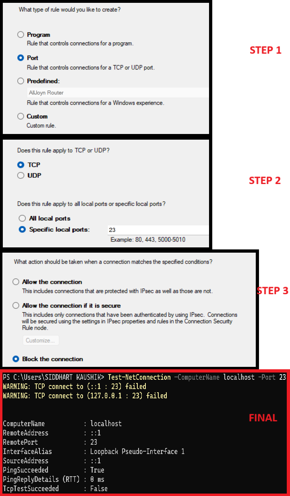

# 🔒 Firewall Setup and Testing (Windows & Linux)

This repo is part of the **Cyber Security Internship - Task 4**.

**Objective:** Configure and test basic firewall rules to allow or block traffic.

---

## 🚀 What You'll Learn
- How to view existing firewall rules
- How to block and allow ports
- How to test firewall rules
- How to remove rules safely
- Why firewalls are critical for network security

---

## 📂 Repository Structure
```
firewall-task/
│
├── README.md              # Main guide with steps
├── windows/
│   ├── firewall-steps.md  # Windows Firewall step-by-step
│   └── screenshots/
│       └── README.md      
│
├── linux/
│   ├── ufw-steps.md       # UFW step-by-step
│   └── screenshots/
│       └── README.md      
│
└── summary.md            
```

---

## 🖥️ Windows Firewall Steps (Quick Guide)
1. Open **Windows Defender Firewall with Advanced Security**.
2. Go to **Inbound Rules → New Rule**.
3. Select **Port**, choose **TCP**, enter `23` (Telnet).
4. Choose **Block the connection** → Apply to all profiles.
5. Test by attempting to connect on port 23.
6. (Optional) Allow SSH (port 22) if needed.
7. Remove the rule to restore the original state.

Here’s a screenshot of my firewall configuration:



---

## 🐧 Linux UFW Steps (Quick Guide)
1. Open terminal.
2. Check firewall status:
   ```bash
   sudo ufw status
   ```
3. Block port 23 (Telnet):
   ```bash
   sudo ufw deny 23
   ```
4. Allow SSH on port 22:
   ```bash
   sudo ufw allow 22
   ```
5. Test connection:
   ```bash
   telnet localhost 23
   ```
6. Remove test rule:
   ```bash
   sudo ufw delete deny 23
   ```
7. Save screenshots of terminal commands.

👉 See details here: [linux/ufw-steps.md](./linux/ufw-steps.md)

---

## 📝 Summary
- Firewalls filter inbound and outbound traffic.
- Blocking Telnet (23) is a common security step since Telnet is insecure.
- UFW makes firewall management simple on Linux.
- Always test and then remove temporary rules.

👉 More details: [summary.md](./summary.md)

---

## 📚 References
- [Microsoft Docs - Create inbound port rule](https://learn.microsoft.com/en-us/windows/security/threat-protection/windows-firewall/create-inbound-port-rule)
- [Ubuntu UFW Documentation](https://help.ubuntu.com/community/UFW)
